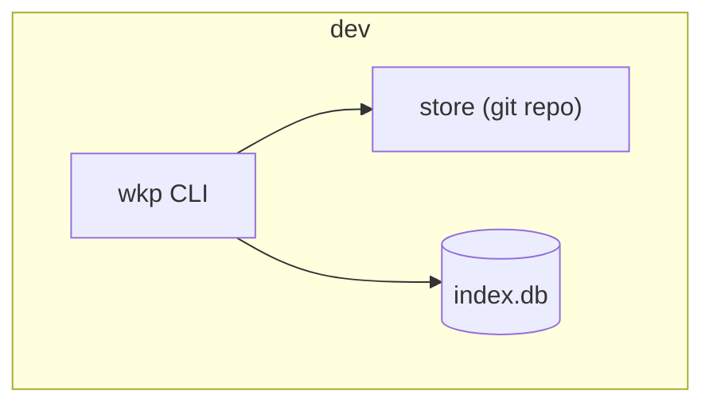
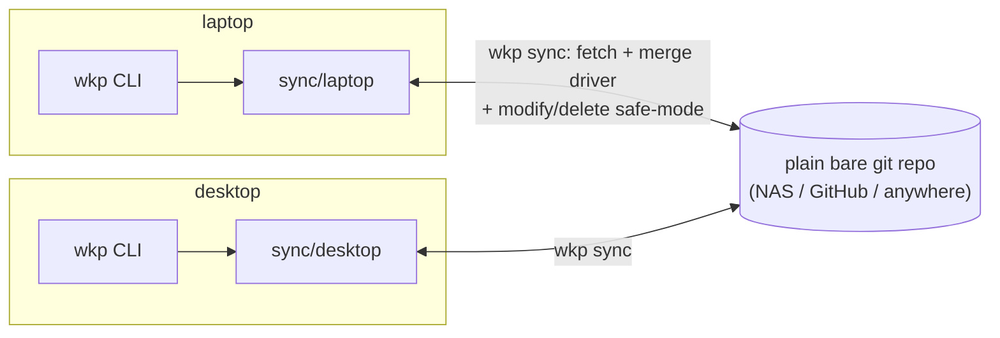
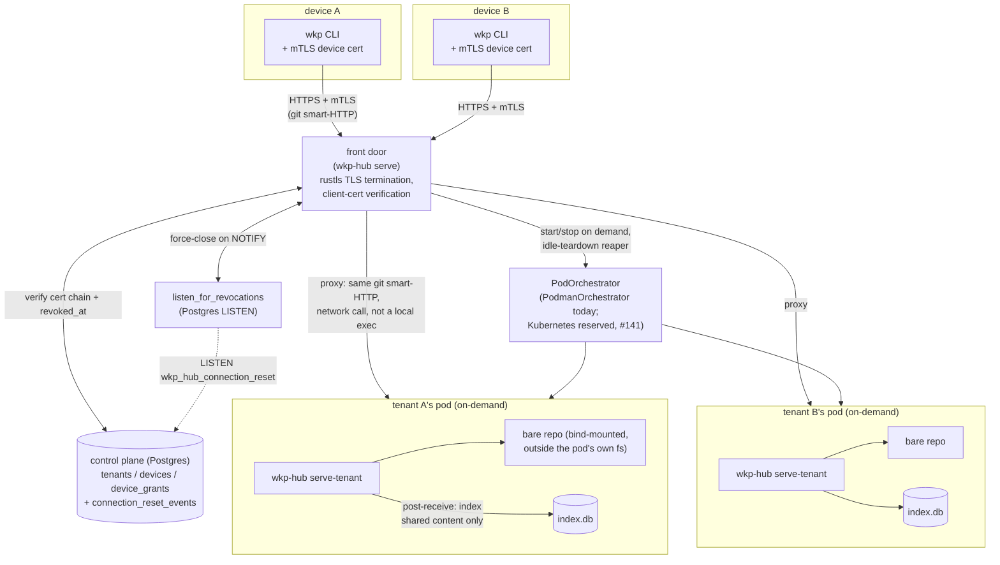
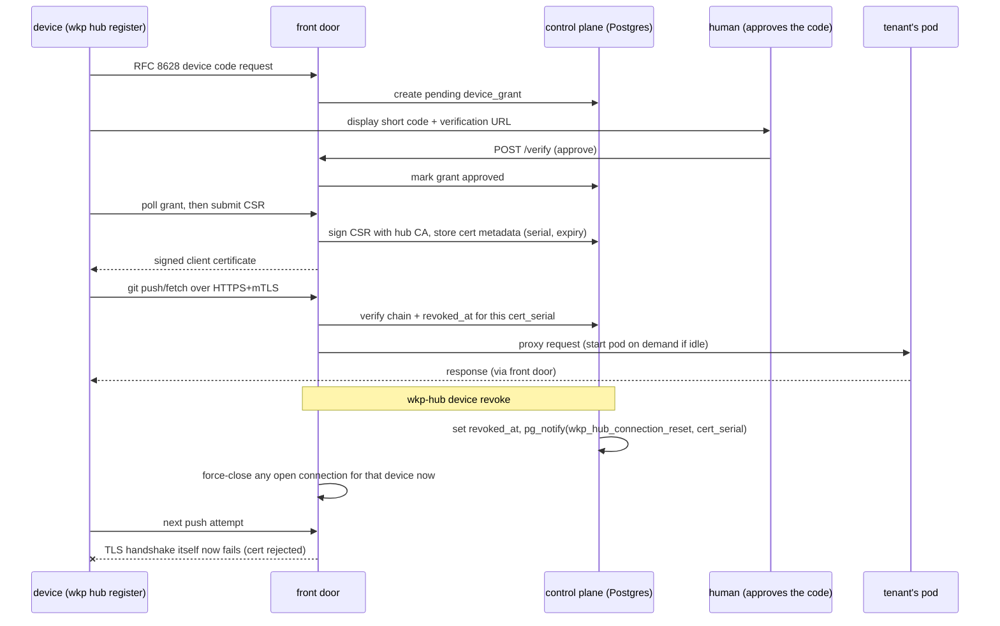

# Architecture: local mode vs. hub mode

A companion to `docs/design/wkp-hub-design-v0.1.md` (the authoritative
design) and the ADRs in `docs/adr/` -- this doc illustrates, rather than
re-decides, how the pieces already described there fit together in the
two shapes `wkp` actually runs in. Read the design doc for *why*; read
this for *what talks to what*.

## The one thing that never changes

The store is a git repository of markdown files with OKF frontmatter,
plus a derived SQLite FTS5 index (`index.db`) rebuilt from it, never the
other way around. Every read (`wkp search`, `context`, `materialize`,
the session-start hook) and every write (`wkp remember`, `promote`) goes
through the same `wkp-core`/`wkp-git`/`wkp-crypto` code whether the
machine running it has ever heard of a hub or not. **Hub mode adds a way
for devices to reach each other and a place to keep them in sync -- it
never changes what one machine does on its own store.** This is
deliberate (design goal: "Local can register with hosted later without
migration").

```mermaid
flowchart LR
    subgraph one machine, either mode
        cli["wkp CLI"] -->|read/write| store["git repo:\nmarkdown + OKF frontmatter"]
        cli -->|wkp index| idx[("index.db\nSQLite FTS5")]
        store -->|derives| idx
        cli <-->|clean/smudge filter| crypto["wkp-crypto:\nage encrypt/decrypt\nvisibility: private only"]
        cli -->|signed commits| keys["OS keystore:\nsigning key (SSH)\nencryption identity (age X25519)"]
    end
```

## Local mode

### Single machine

No network at all. `wkp init/index/search/context/materialize/remember/
promote/hooks` operate purely against the local filesystem. This is the
whole system for a single-device user.



### Multiple machines, still no hub

M3's sync mechanism: each device commits to its own `sync/<device-id>`
branch (never sharing a ref, so two machines can never write the same
one) and `wkp sync` fetches/merges every other device's branch plus
`main` into the local one, then pushes. The remote is a **plain bare git
repo** -- a NAS, a personal GitHub repo, anything `git push`/`git fetch`
already works against. It has no opinion about tenants, certificates, or
revocation; every device here is trusted equally because the same person
owns all of them. `wkp bundle export`/`import` covers the air-gapped
case (`git bundle` instead of a live remote).



Merging itself uses `wkp merge-driver` (frontmatter-aware: union tags,
max `updated`, keep both provenance entries) and a separate
modify/delete safe-mode pass, since git's own merge machinery never
invokes a content driver for that case (design 6.2, M3-2/M3-3).

## Hub mode

Adds a hosted `wkp-hub` (design section 8, ADR-0009/0010/0011/0012):
mutual-TLS transport instead of a plain git remote, per-tenant hard
isolation instead of one shared repo, and a control plane that can issue
and revoke device access instead of trusting every device unconditionally.



Each tenant's pod is its own hard isolation boundary (a container-runtime
pod, not a Unix-UID switch inside one shared container, ADR-0009) --
never reached via `podman exec` from the front door, since that has no
Kubernetes equivalent a running service could rely on later (ADR-0009,
ADR-0012). The front door only ever proxies plain network requests to a
pod's own `git http-backend`, identical under either backend.

### Register, push, revoke -- the flow the milestone's own integration test exercises



## What's different, side by side

| | Local mode | Hub mode |
|---|---|---|
| Transport | `git` over SSH/HTTPS to a plain remote, or a `git bundle` file | HTTPS with mutual TLS, hub-issued certificates only |
| Trust model | Whoever holds a device's own SSH signing key / can reach the remote | RFC 8628 device grant, human-approved, CSR signed by the hub's own CA |
| Isolation | N/A -- one user, one store, every device equal | One container-runtime pod per tenant; a bug in one tenant's request handling can't reach another's repo |
| Revocation | None -- removing a device means rotating its access by hand (`wkp forget --device`, age recipients) | `wkp-hub device revoke`: next connection *and* any already-open one both fail |
| Where plaintext lives | Only ever on a user's own devices | The tenant's own pod indexes `shared` (plaintext) content; `visibility: private` content stays ciphertext the hub never has a key for |
| Control plane | None | Postgres: `tenants`, `devices`, `device_grants`, `connection_reset_events` |

## What's identical either way

- The store's own format: markdown + OKF frontmatter, nothing new.
- `index.db`'s schema and how it's derived (`wkp index`, tier computation).
- The encryption story for `visibility: private` items (`wkp-crypto`'s
  clean/smudge filter, age X25519) -- a hub, if used, never gets a
  decryption key for these; it only ever sees ciphertext.
- Every read/write CLI command's own behavior -- the hub only changes
  how a repo's bytes get from one device to another, not what a device
  does with them locally.
